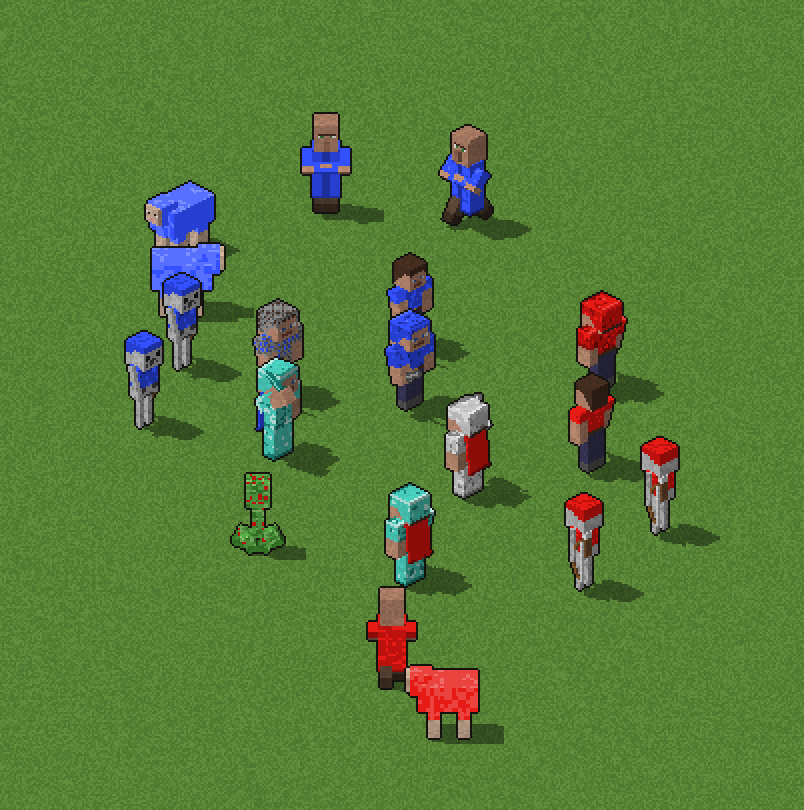

# Age of Minecraft

A mod for **Age of Empires II: Gold Edition** that replaces the units with
blocky, pixel-art Minecraft-style figures: villagers in robes, crafters with
wooden swords, diamond-armoured champions, skeleton archers, and creepers as
petards.



The sprites are generated, not hand-drawn. Each unit is a Minecraft-style box
model, and a small renderer draws it from AoE2's isometric camera, in all
directions and animation frames, with team-colour regions ready for the game
palette.

See [docs/DESIGN.md](docs/DESIGN.md) for the art direction, the full unit
mapping and the path into the game.

## Previews

```sh
pip install -r tools/requirements.txt
python tools/concept_sheet.py        # writes previews/*.png and previews/animations.gif
```

| File | Shows |
|---|---|
| `previews/roster.png` | every unit in all 8 directions |
| `previews/scene.png` | an in-game mock-up of two armies on AoE2-sized tiles |
| `previews/animations.gif` | walk, attack and death cycles |
| `previews/player_colors.png` | a unit in all 8 player colours |

## Layout

```
tools/aom/textures.py    pixel-art texture helpers (ASCII-art faces, noise, team colour)
tools/aom/geometry.py    box models: parts, pivots, held items as extruded sprites
tools/aom/render.py      isometric ray-caster -> palette-agnostic frames
tools/aom/animation.py   stand / walk / attack / die poses per rig
tools/aom/units.py       the unit models
tools/concept_sheet.py   preview generator
```

## Status

Concept stage: 9 units are modelled and animated. Next come palette
quantisation, the SLP encoder, and the rest of the roster.
