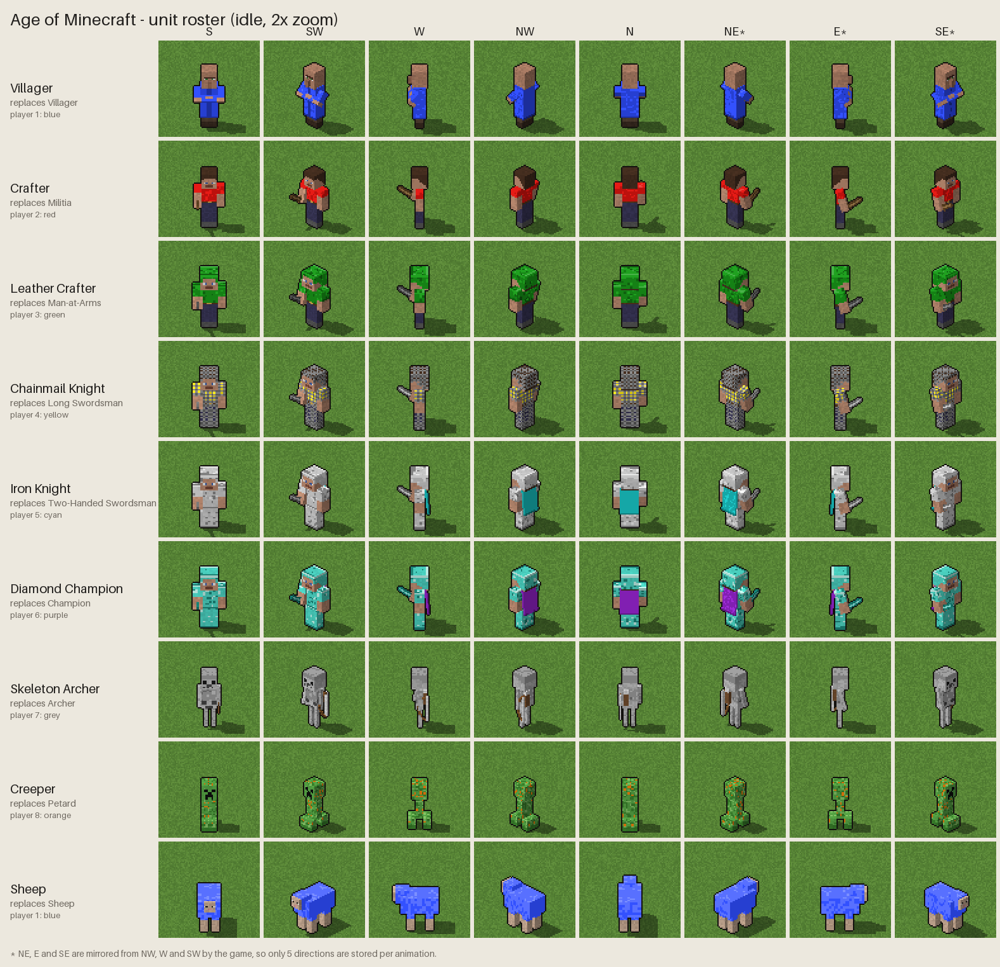
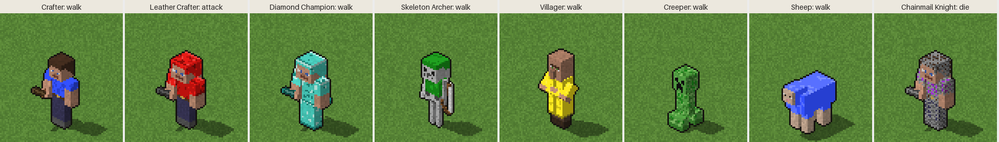

# Age of Minecraft — design

A graphics mod for **Age of Empires II: Gold Edition** (The Age of Kings +
The Conquerors) that redraws the units as blocky, pixel-art Minecraft-style
figures. Gameplay stays the same; only the sprites and unit names change.



## Art direction

| Rule | Value | Why |
|---|---|---|
| Model units | Minecraft pixels: head 8×8×8, body 8×4×12, limbs 4×4×12 | The classic proportions everyone recognises |
| Scale | 1.5 screen px per Minecraft pixel → infantry ≈ 45 px tall | Roughly the size of AoE2 units on a 96×48 tile |
| Camera | Orthographic, looking down at 30° (AoE2's 2:1 isometric view) | Sprites sit correctly on AoE2 terrain |
| Sampling | Nearest texel, no anti-aliasing | Keeps the pixel look and suits AoE2's 256-colour palette |
| Light | From the upper left and front; Minecraft-like flat face shading | Matches the lighting of the original sprites |
| Shadow | Ground shadow toward the lower right, stored as SLP shadow pixels | AoE2 blends shadows itself |
| Outline | 1 px dark outline | Tiny sprites stay readable on busy terrain |
| Team colour | 8 shades per player, on clothing, dyed leather, capes and wool | AoE2 swaps these palette ranges per player |

Every texture is original pixel art in the Minecraft *style*: no Mojang
texture files are used or needed.

### Where team colour goes

Team colour is Minecraft's own dye system: shirts, dyed leather armour, capes,
wool, and (later) wolf collars, llama carpets and banners. Units in full
metal armour get a team-coloured cape, so you can always tell who owns them.

## Unit mapping

✅ = modelled in the current concept · 🧱 = planned

| AoE2 unit | Minecraft figure | Team colour on | |
|---|---|---|---|
| Villager | Villager (robe, crossed arms, big nose) | robe | ✅ |
| Militia | Crafter with a wooden sword | shirt | ✅ |
| Man-at-Arms | Crafter in a leather cap and tunic, stone sword | dyed leather | ✅ |
| Long Swordsman | Chainmail armour, iron sword | shirt showing through the chainmail | ✅ |
| Two-Handed Swordsman | Full iron armour, iron sword, cape | cape | ✅ |
| Champion | Full diamond armour, diamond sword, cape | cape | ✅ |
| Archer | Skeleton with a bow | leather cap and tunic | ✅ |
| Crossbowman / Arbalest | Pillager with a crossbow / Pillager captain with a banner | banner, sleeves | 🧱 |
| Skirmisher line | Snow Golem (lobs snowballs) | pumpkin band / scarf | 🧱 |
| Spearman / Pikeman / Halberdier | Drowned with a trident | torn shirt | 🧱 |
| Scout / Light Cavalry / Hussar | Crafter on a horse with leather horse armour | horse armour | 🧱 |
| Knight / Cavalier / Paladin | Crafter on a horse with iron, gold or diamond horse armour | saddle blanket, cape | 🧱 |
| Cavalry Archer | Skeleton horseman | cap, tunic | 🧱 |
| Camel | Llama with a carpet | carpet | 🧱 |
| Monk | Evoker (or Witch) | robe | 🧱 |
| Battering Ram | Ravager | harness | 🧱 |
| Mangonel / Onager | Dispenser on a minecart | banner | 🧱 |
| Scorpion | Arrow dispenser on wheels | banner | 🧱 |
| Bombard Cannon / Trebuchet | TNT cannon | banner | 🧱 |
| Petard | Creeper | speckles in the skin | ✅ |
| King (Regicide) | Crafter in netherite with a gold crown | cape | 🧱 |
| Trade Cart | Minecart with a chest | banner | 🧱 |
| Ships | Oak boats with team sails | sails | 🧱 |
| Sheep | Sheep with dyed wool | wool | ✅ |
| Wolf | Wolf | collar | 🧱 |
| Deer / Boar / Turkey | Cow / Hoglin / Chicken | — (Gaia) | 🧱 |

Unique-unit ideas: Teutonic Knight → netherite knight · Berserk / Throwing
Axeman → Vindicator · Samurai → Piglin Brute · Woad Raider → Zombie ·
War Elephant → Iron Golem · Mameluke → Blaze.

## Animations

AoE2 needs a set of sprites for each unit: **stand, walk, attack, die and
decay** (the corpse). Each animation is stored for 5 directions (S, SW, W,
NW, N). The game mirrors those to get NE, E and SE. Because the figures are 3D
box models, every direction and frame is rendered automatically, with no
redrawing by hand:

* **walk**: legs and arms swing in opposite directions, the way Minecraft mobs walk
* **attack**: an overhead chop (swordsmen), drawing the bow (archers)
* **die**: Minecraft's death: the body tips over sideways and flashes red
* **decay**: planned as the corpse turning into a puff of smoke, like mob deaths in Minecraft



## Pipeline

```
box model + pixel textures  ──render──▶  frames (colour + team-colour mask + shadow)
        ──quantise──▶  AoE2 palette indices  ──encode──▶  .slp files
        ──import──▶  Data/graphics.drs  (on the player's PC)
```

1. **Render** (`tools/aom`) — done. A small ray-caster draws the models from
   the AoE2 camera angle. It keeps each pixel's kind (solid, team colour,
   shadow, outline) separate, so the output can be converted exactly to SLP.
2. **Quantise** — next. Snap solid colours to the AoE2 256-colour palette
   (`50500` in `interfac.drs`). Team-colour pixels become player-colour
   indices instead.
3. **Encode SLP** — next. Write SLP 2.0N frames: outline table, row
   commands, player-colour and shadow commands, and the hotspot at the unit's
   feet.
4. **Install** — on the player's PC. Replace the unit SLPs in `graphics.drs`
   with a DRS editor, or ship them as a UserPatch data mod. Rename units in the
   language DLL. Each replacement SLP must have the same number of frames per
   direction as the one it replaces, or the frame counts must be changed in the
   `.dat` with Advanced Genie Editor.

None of this needs the game on the machine that builds the mod. The game and
modding tools are only needed at step 4.

## Open questions

* Villager: keep the crossed-arm Minecraft villager, even though work
  animations (chopping, mining) would then need the arms to uncross? Or use a
  Crafter in overalls for the villager?
* Creeper: team-colour speckles, or plain green with only its feet in team
  colour?
* Scale: are infantry at ≈ 45 px the right size next to the original
  buildings, or should they be a little smaller?
* Buildings: stop at units, or also do block-built houses, town centres and
  castles?
