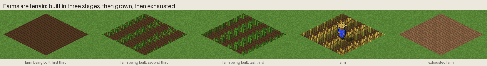
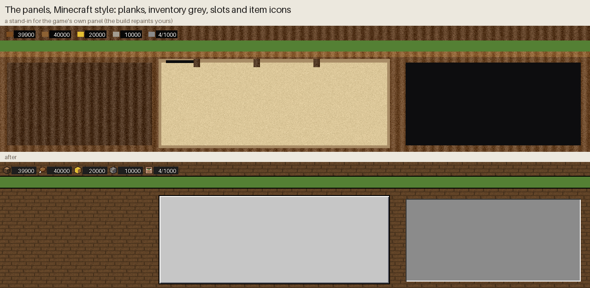
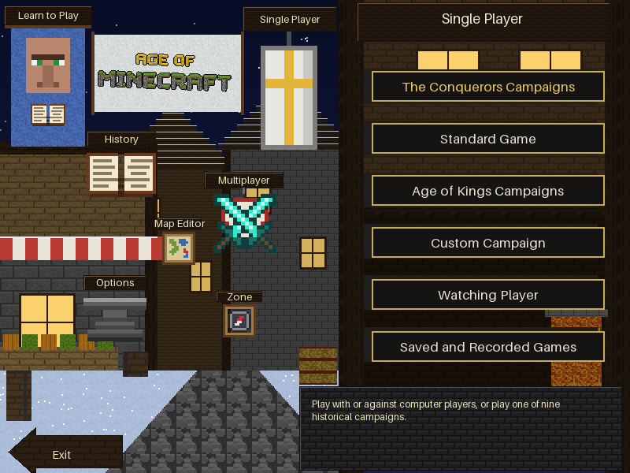
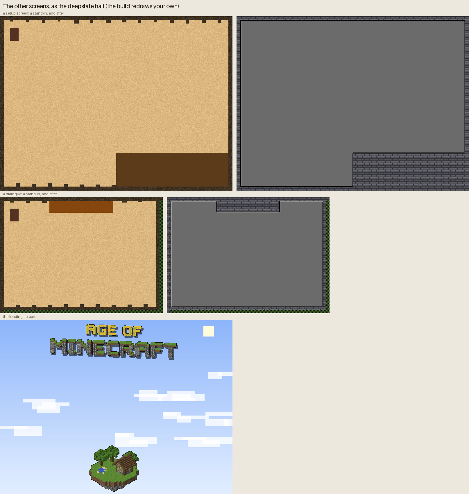

# Age of Minecraft — design

A graphics mod for **Age of Empires II: Gold Edition** (The Age of Kings +
The Conquerors) that redraws the units and buildings as blocky, pixel-art
Minecraft-style figures. Gameplay stays the same; only the sprites and unit
names change.


## Art direction

| Rule | Value | Why |
|---|---|---|
| Model units | Minecraft pixels: head 8×8×8, body 8×4×12, limbs 4×4×12 | The classic proportions everyone recognises |
| Scale | 1.5 screen px per Minecraft pixel → infantry ≈ 45 px tall; large siege and ships are drawn 1.1–1.6× bigger | Roughly the size of AoE2 units on a 96×48 tile |
| Camera | Orthographic, looking down at 30° (AoE2's 2:1 isometric view) | Sprites sit correctly on AoE2 terrain |
| Sampling | Nearest texel, no anti-aliasing | Keeps the pixel look and suits AoE2's 256-colour palette |
| Light | From the upper left and front; Minecraft-like flat face shading | Matches the lighting of the original sprites |
| Shadow | Ground shadow toward the lower right, stored as SLP shadow pixels | AoE2 blends shadows itself |
| Outline | 1 px dark outline | Tiny sprites stay readable on busy terrain |
| Team colour | 8 shades per player, on clothing, dyed leather, capes and wool | AoE2 swaps these palette ranges per player |

Every texture is original pixel art in the Minecraft *style*: no Mojang
texture files are used or needed.

### Where team colour goes

Team colour is Minecraft's own dye system: shirts, dyed leather armour, capes,
wool sails, llama carpets, saddle blankets and banners. Units in full metal
armour get a team-coloured cape, so you can always tell who owns them. Mobs
wear team colour too: skeletons get a dyed leather cap and tunic, and zombies
a team shirt. Siege weapons fly a team flag.

## Units

All **90 units** of the game are modelled; the complete list is in
[UNITS.md](UNITS.md). Each group has a preview sheet in `previews/roster_<group>.png`
and an animation sample in `previews/anim_<group>.gif`.

| Group | Minecraft take |
|---|---|
| Villager jobs | Minecraft villagers. They stand with crossed arms, and uncross them to work with the job's tool (axe, pickaxe, hoe, hammer, bow, fishing rod, shears). They carry logs, ore blocks, wheat or meat. The farmer wears a straw hat and the fisherman a bucket hat. |
| Swordsmen | Crafters whose armour goes up the tiers: none → leather → chainmail → iron → diamond, with wood → stone → iron → diamond swords |
| Spearmen | Drowned with tridents, gaining chainmail and iron |
| Archers | Skeleton → Pillager (crossbow) → Pillager Captain with a banner. Skirmishers are Snow Golems. The Hand Cannoneer carries a copper firework gun. |
| Eagle Warriors | Crafters in parrot-feather headdresses with clubs |
| Cavalry | Crafters on horses in Minecraft horse armour: leather → iron → gold → diamond |
| Camels | Llama riders; the llama wears a team carpet |
| Cavalry Archers | Skeleton horsemen |
| Monk / Missionary | Cleric villager in a hooded team robe with a book (the Missionary rides a donkey) |
| Siege | Ravager rams (bare → iron-capped → netherite). Dispenser minecarts as mangonels. Crossbow turrets as scorpions. A TNT cannon with an obsidian barrel. A log-frame trebuchet that packs flat. |
| Wagons | War Wagon as a covered wagon with a team canopy; Trade Cart as a chest minecart pulled by a donkey |
| Ships | Minecraft boats scaled up, with team wool sails. The Fire Ship carries a campfire (soul fire when upgraded), the Demolition Ship is loaded with TNT, and the Cannon Galleon mounts a TNT cannon. |
| Unique units | Longbowman → Stray · Woad Raider → Zombie · Chu Ko Nu → Illusioner · Throwing Axeman → Piglin · Huskarl → Piglin Brute · Samurai → Wither Skeleton · War Elephant → Iron Golem · Teutonic Knight → netherite knight · Janissary → Blaze · Berserk → Vindicator · Jaguar Warrior → ocelot-hooded warrior · Plumed Archer → Bogged · Cataphract → netherite-barded horseman · Mangudai → Pillager on horseback · Mameluke → Husk on a llama · Tarkan → Zombie on a zombie horse · Conquistador → firework rider · War Wagon → armoured wagon · Longboat → spruce longship with shields · Turtle Ship → turtle-shell ship |
| Animals | Sheep (dyed wool) · Turkey → Chicken · Deer → Goat · Wild Boar → Hoglin · Javelina → Pig · Wolf |


## Buildings


Buildings are made of real Minecraft-scale blocks, at the same scale as the
units: a unit is 2 blocks tall, as in Minecraft. One AoE2 tile comes to about
2.83 blocks at the render scale, so:

| Footprint | Blocks | Examples |
|---|---|---|
| 1×1 tile | 3×3 | towers, wall pieces, gate towers |
| 2×2 tiles | 5×5 | House, Mill, Lumber / Mining Camp |
| 3×3 tiles | 8×8 | Barracks, Archery Range, Stable, Blacksmith, Monastery, University, Dock |
| 4×4 tiles | 11×11 | Town Center, Castle, Market, Siege Workshop |
| 5×5 tiles | 14×14 | Wonder |

Buildings are drawn from a single angle (their south-west and south-east
walls face the camera). Team colour shows on banners, flags and the bell
tower's wool cap. All sheets: `previews/buildings.png`,
`previews/fortifications.png`, `previews/wonders.png`, `previews/nature.png`,
`previews/farms.png`.

### Five village styles, four ages

AoE2 draws buildings in five regional styles plus a shared Dark Age look.
Each becomes a Minecraft village style, and each age upgrades the materials:

| AoE2 style | Minecraft style | Materials |
|---|---|---|
| Dark Age (everyone) | log cabins | oak logs, cobblestone, thatched hay roofs |
| West European | Plains village | oak and cobblestone, then half-timbered plaster under brick roofs |
| Central European | Taiga village | spruce and mossy stone under slate (deepslate tile) roofs |
| Middle Eastern | Desert village | sandstone with crenellated flat roofs, terracotta domes, striped awnings |
| Asian | cherry and bamboo | white walls, red pillars, dark roofs with upturned eaves |
| Meso-American | Jungle temple | mossy stone bricks, jungle wood, thatch, gold |

Ages: Feudal is planks and cobblestone, Castle stone bricks, Imperial polished
stone with gold trim (and corner towers on the Town Center).

### Building mapping

| AoE2 building | Minecraft build |
|---|---|
| House | a cottage (three variants, like the game's three house frames) |
| Town Center | village hall with a bell tower; domed in the desert, stepped in the jungle |
| Mill | windmill with turning wool sails (Dark Age: a grinding hut with a grindstone) |
| Farm | Minecraft farmland with wheat (see *Farms* below) |
| Lumber / Mining Camp | an open shed with log piles and a chopping block / a minecart on rails with ore |
| Barracks | a hall with a fenced training yard and armour stands |
| Archery Range | target blocks on hay bales and a fletching table |
| Stable | a barn with hay, a water trough and a paddock |
| Blacksmith | a stone forge with a chimney, anvil, blast furnace, lava and rising smoke |
| Market | stalls with striped wool awnings, barrels, chests and an emerald block |
| Monastery | a chapel with stained glass and a bell tower |
| University | a library of bookshelves with an enchanting table |
| Siege Workshop | pistons, dispensers, TNT and logs |
| Dock | a plank pier with a boathouse, barrels and a crane |
| Fish Trap | a ring of fences and nets with fish |
| Watch / Guard Tower, Keep | wooden lookout → stone tower with battlements → keep with an overhanging top |
| Bombard Tower | a squat deepslate tower with dispensers and TNT |
| Outpost | a lookout post with a torch |
| Palisade / Stone / Fortified Wall | spruce stakes / cobblestone wall / stone bricks with battlements; diagonal walls are block staircases; ends and corners are pillars filling the tile, so every wall line joins up |
| Gates | an arch with an iron-bar portcullis, down when shut and up when open, between two towers |
| Castle | curtain walls, four corner towers, a gatehouse and a keep, in the civilisation's style |
| Wonders | one per civilisation: Westminster, Chartres, Hagia Sophia, the Temple of Heaven, Templo Mayor, Tikal, Hwangnyongsa and the rest |
| Building sites, rubble | scaffolding on a foundation; scattered cobblestone and gravel |

### Farms



In The Conquerors a farm is not a sprite: it is part of the ground. A farm
changes the terrain under it, and the farm's look is a terrain texture in
`terrain.drs`. There are five of them: three stages while a villager builds
the farm, the finished farm, and the exhausted farm. Each becomes Minecraft
farmland, 2 blocks to a tile (a little bigger than the units' blocks, so the
wheat is easy to see), with rows of wheat and rows of bare farmland between
them. The wheat has thick stalks and big grain heads in flat colours:

| AoE2 | Minecraft |
|---|---|
| Farm being built (three stages) | freshly tilled farmland, then sprouting wheat, then half-grown green wheat |
| Farm | ripe golden wheat |
| Exhausted farm | dry farmland with nothing on it |

The game picks one texture tile per map tile, so the pattern repeats every
tile and the tiles always join up. Each tile keeps the original tile's exact
shape, so a farm's edges still blend into the grass as before.

### The panels



The resource bar at the top of the screen and the panel at the bottom (commands, the selected unit's details,
the minimap) are one picture per civilisation and screen size in `interfac.drs`. UserPatch builds its
widescreen panels from the same pictures. The build repaints each one, every pixel keeping its place:

| AoE2 | Minecraft |
|---|---|
| Parchment (where the game writes the unit's details) | the grey of Minecraft's inventory, with a black edge, a white bevel at the top left and a dark one at the bottom right |
| The resource bar (the game writes the amounts in white) | one layout in every picture: each item the same size, in line, and 2 pixels after it a flat, nearly black box, wide enough for "4/1000", with a five-digit amount in its middle |
| Dark areas (behind the minimap) | an inventory slot, sunk in |
| Carved frames | planks, as dark or light as the original frame, so the game's text stays readable |
| Resource icons: wood, food, gold, stone, population | an oak log, a leg of meat, a gold block, cobblestone, a villager's face, all as big |
| Where a panel meets the game view | a black edge, like every Minecraft window |

Every panel picture has the same bar: an icon every 77 pixels, each followed by a dark box. The game writes
each amount right-aligned in it, so a longer amount reaches further left, and the new box is widest on its left.
A picture whose boxes aren't there keeps its original look, so no resource loses its icon.

UserPatch draws a food icon of its own over the bar's: a steak on a black square. The build redraws it as the
bar's leg of meat, in the same place, with nothing around it, so the bar shows through.

### The main menu



The main menu is one 800x600 picture (`interfac.drs` 50189) with, for every
button, pictures drawn over it at its place: the object cut out, with a yellow
glow (the mouse is on it), with a white glow (pressed), and plain. The game
writes the button names and the Single Player menu over the picture. Age of
Minecraft's menu is a Minecraft world on a clear day: a village house with a
lectern on its roof, a stone brick tower, green hills and snowy mountains, and
the block logo floating in the sky, with each button a Minecraft thing in the
original's exact place. Every button name is on a Minecraft menu button (stone
grey, a light top edge, a dark bottom edge, a black outline), as wide as the name
really is in the game, and written in white. While the mouse is on a button,
its thing turns darker and its name yellow; there is no glow.

The right side, where the Single Player menu opens, is Minecraft's own menu
background, dark dirt, and the game draws that menu's buttons as Minecraft
buttons. The description of a button is in a Minecraft tooltip, near black
with a purple edge. The menu has colours of its own: the original ones were
made for a night in the snow and had no greens.

| Button | Minecraft |
|---|---|
| Learn to Play | a banner with a villager and a book, on an oak pole |
| Single Player | a shield with a gold cross, hanging on the tower |
| History | an open book on a lectern |
| Multiplayer | two diamond swords crossed over a shield |
| Map Editor | a map in an item frame, on a fence post |
| Options | an anvil on a stone block |
| Zone | a compass in an item frame |
| Exit | an arrow-shaped Minecraft button |
| the title | "AGE OF MINECRAFT" in blocks (gold, and grass on cobblestone), floating in the sky |

The button pictures are cut from the new picture at the same places. The build
only replaces a menu whose pictures have the sizes it was designed for.

### The other screens and the window



Every other screen (game setup, history, achievements, the dialogues in the
game, the loading screen) is described by a small screen file in
`interfac.drs`: its pictures for the three screen sizes, its palette, and the
colours the game draws its buttons and text in. The build finds them all,
lists them in the report and saves them as `screen_originals\`.

Almost all of them are parchment, and the game writes on it in white, in
cream with a black shadow, in black, or in the players' colours. The **deepslate
hall** makes each sheet a Minecraft window in a middle grey, where all of those
can be read, with straight edges and Minecraft's light and dark bevel.
Everything around the windows of one picture is one material, never a mix:
deepslate tiles, or dark oak planks for the campaigns' dialogues and the
achievements (their dark tabs would be lost on deepslate). The history book gets two grey pages, with its list of topics sunk in.
The loading screen is a Minecraft title screen: a blue sky with blocky clouds
and a square sun, the gold and grass block logo with a dark shadow at the top,
and a floating island of blocks with a pond, oak trees, flowers and a little
house at the bottom. The middle of the screen is light sky only, where the
game writes its loading text in black.
Only this screen uses its
palette, which was nearly all greys, so it gets a palette of its own made from
the new picture (the Windows colours stay where they were).

The achievements are a dark grey window (Minecraft's `#373737`) for the game's
white and cream titles, with a light grey panel on it where the scores are
written in each player's colour: no single grey suits both. The timeline and
the dark dialogue backgrounds are the dark grey too. Under the window, on a dark oak
floor, the tabs (Score to Timeline) are Minecraft tabs: the chosen one in the
window's grey, opening into it, the others darker. Their top rows used to carry
on the parchment under the Play Again and Main Menu buttons; those rows are left
out, so the tabs no longer run into the buttons. The flags the players' names
are written on become Minecraft banners in the flag's own colour, on a dark oak
pole, a little taller and wider than the flags, with a grey stripe across
them that holds a long name on two lines. The game writes the name in white,
in black or in the player's colour, and all three show on a middle grey. The team
marks are Minecraft shields in each team's pattern (white; white and red;
red and black under white; quartered), with the dark middle the game writes
the team's number in, and a dash for no team.

The mod also tells UserPatch where the game's own texts are, so every
civilisation keeps its name and every computer player gets a name (they used
to come out blank for the Spanish, Aztecs, Mayans, Huns and Koreans).

Each picture is drawn in the palette of every screen that shows it, keeps its
size and its see-through parts, and only the pictures the build knows, at
their sizes, are changed. The campaign maps and the credits keep their look.

The mod's own exe says **Age of Minecraft** in its window and on the taskbar:
the text "Age of Empires II Expansion" is replaced where it stands on its own,
in place, in `age_of_minecraft.exe` only. Other texts are left alone: longer
ones that contain it, and the name the game's settings are saved under ("Age
of Empires II: The Conquerors Expansion"), so your settings carry over.

### Nature and decorations

| AoE2 | Minecraft |
|---|---|
| Forests | oak, birch and dark oak; spruce; snowy spruce; palms; jungle trees; bamboo. Each tree is grown to the height of the original so forests keep their look. |
| Chopped trees | a stump beside the felled trunk |
| Gold / Stone mines | heaps of gold ore and raw gold / stone, cobblestone, andesite and diorite |
| Forage bushes | sweet berry bushes |
| Map decorations | rocks, grass and flowers, cactus, hay bales, yurts, tents, ruins, graves, mob heads on posts, a statue, signposts, torches, waving banners, the relic as a golden reliquary |
| Animals | Hawk → Phantom · Macaw → Parrot · Jaguar → Ocelot · Horse → horse · fish → cod, salmon, tropical fish and pufferfish · Marlin → Dolphin |

### Easter eggs

Pac-Man takes Furious the Monkey Boy's slot (unit 860): a voxel ball whose
jaw chomps as he runs and attacks, and who dies the arcade way. A ghost in
the owner's team colour takes the VDML cheat guy's. Pac-Man is also the one
rule change: every civilisation can train him at a finished Wonder
(`gameplay.py` patches his unit in the `.dat`: enabled, trained at the
Wonder, 500 food and 500 gold, 30 s, 250 hit points, speed 5 (faster than
any unit, the cheats' Cobra Car included), and infantry instead of
the Monkey Boy's "predator animal" class, which Transport Ships refuse; he
also gets the Militia's "board a Transport Ship" task if his task list lacks
it, and the Militia's terrain restriction: like the wild animals, the Monkey
Boy may not stand on beaches, and ships unload onto the beach). He gets his own Pac-Man icon, added at the end of the unit icon sheet
so no other unit's icon changes, and `langdll.py` renames him "Pac-Man" in
the game's language files: his name string and the old name inside his
button and help texts are rewritten in place (shorter text in the same
string block), so the rest of each DLL stays byte-for-byte the same.

His sounds (`sounds.py`) are synthesised, nothing sampled: the "waka"
chomp is a triangle-wave pitch sweep down and back up, with a boing, a
bloop, a giggle, "nom nom", a jingle and a sad trombone slide around it.
They are new entries at the end of the `.dat`'s sound table (the Monkey
Boy's own sounds are the wolf's), their WAV files go into
`gamedata_x1_p1.drs` on free resource ids, and his unit's selection, move,
attack and train sounds point at them. His bite and death sounds replace
the sounds of his attack and dying animations, on the same frames.

### Projectiles

Arrows are Minecraft arrows (flint tip, white fletching), pitched as they
climb and dive; scorpions shoot bigger bolts; throwing axemen and mamelukes
throw spinning axes and swords; the snow golem skirmishers throw snowballs;
mangonels hurl cobblestone, trebuchets mossy boulders, and the bombard cannon
fires TNT.

### Construction and destruction

* **construction**: scaffolding on a foundation (the game raises the finished
  building through it); walls and gates rise in stages with scaffolding on top
* **damage**: walls lose blocks at each damage level; the game's own fires
  still burn on damaged buildings
* **rubble**: scattered cobblestone, gravel and broken planks

## Animations

AoE2 needs a set of sprites for each unit: **stand, walk, attack, die and
decay** (the corpse), and villagers also walk while carrying. Each animation
is stored for 5 directions (S, SW, W, NW, N). The game mirrors those to get
NE, E and SE. Because the figures are 3D box models, every direction and
frame is rendered automatically, with no redrawing by hand.

Each unit has a **rig** (how its body moves) and an **attack style**:

| Attack style | Units | Motion |
|---|---|---|
| chop | swordsmen, cavalry, villagers at work | overhead swing |
| thrust | spearmen | pull back, then stab |
| bow | archers, cavalry archers | raise the bow, draw, release |
| crossbow / gun | crossbowmen, hand cannoneers | recoil |
| throw | skirmishers, throwing axemen, mamelukes | wind up and throw |
| cast | monks | both arms raised, waving |
| punch / slam | zombies, iron golem | arms swing together |
| work motions | fisherman, forager, shepherd | cast the rod, bend and pick, snip |
| ram / fire | ravagers, carts, ships | head-butt, recoil |
| trebuchet | trebuchet | the counterweight drops and the arm throws over the top; it packs flat to move |

Deaths use Minecraft's look: the body tips over sideways and flashes red.
Siege burns and tips over, and ships sink. Decay (the corpse) is planned as a
puff of smoke, like mob deaths in Minecraft.


## Pipeline

```
box model + pixel textures  ──render──▶  frames (colour + team-colour mask + shadow)
        ──quantise──▶  AoE2 palette indices  ──encode──▶  .slp files
        ──import──▶  Data/graphics.drs, farms into Data/terrain.drs  (on the player's PC)
```

1. **Render** (`tools/aom`). A small ray-caster draws the models from the
   AoE2 camera angle. It keeps each pixel's kind (solid, team colour, shadow,
   outline) separate, so the output converts exactly to SLP.
2. **Quantise** (`palette.py`). Solid colours snap to the game's own
   256-colour palette (`50500` in `interfac.drs`), using nearest colour in
   CIELAB. Team-colour pixels become the 8 player-colour shades.
3. **Encode SLP** (`slp.py`). SLP 2.0N frames with outline tables, row
   commands, player-colour, shadow and the team-colour silhouette outline
   (shown when a unit is behind a building). The hotspot sits at the unit's
   feet.
4. **Match the original** (`build_mod.py`, on the player's PC). For each
   original sprite (unit ids in `slpmap.py`; buildings, walls, trees and
   decorations found by name in the `.dat` by `spritemap.py`), the frame
   count, angle count and mirroring are read from the player's
   `graphics.drs` and `.dat`, and the sprite is rendered in exactly that
   layout. Extra layers of composite sprites (ram heads, sails, building
   shadows, roof pieces, flags) are blanked. Each wall frame gets the piece
   the game draws in it (frame 0 "/", 1 "\\", 2 the post at ends and
   corners, 3 "--", 4 "|"), and forest trees are grown to the height of the
   tree they replace. The farm textures are found in the `.dat`'s terrain
   table (terrains 7, 8, 29, 30 and 31), and each of their tiles is redrawn
   in exactly the pixels of the original tile.
5. **Install** as a UserPatch 1.5 data mod, a game of its own called Age of
   Minecraft: `Games\age_of_minecraft.xml`, and in
   `Games\age_of_minecraft\Data\` its own `empires2_x1_p1.dat`,
   `language_x1_p1.dll` (the game's, with Pac-Man's name and "Age of
   Minecraft" added in a new section at its end) and `gamedata_x1_p1.drs`.
   A UserPatch mod's Data folder is read for those three only, so every
   changed sprite, farm texture, panel, menu picture, icon and sound goes into
   its `gamedata_x1_p1.drs` (the game's, plus ours), which the game looks in
   first, as WololoKingdoms does. `SetupAoC.exe -g:age_of_minecraft` makes
   `age2_x1\age_of_minecraft.exe` once (it returns at once and finishes when
   Install is clicked in its window, so the build waits for the exe), and the
   villager king icon goes into its icon pictures in place, and its window
   title becomes "Age of Minecraft" (in place too). An "Age of
   Minecraft" shortcut with the icon starts it (or, without that exe,
   `age2_x1.exe GAME=age_of_minecraft`). The game's own `age2_x1.exe` is
   checked before and after `SetupAoC.exe` runs, and put back if it changed.
   A `--mode direct` fallback patches `Data\graphics.drs`,
   `Data\terrain.drs` and `Data\interfac.drs` with backups.

See [INSTALL.md](INSTALL.md) for how to run it.

## Open questions

* Villager: idle villagers keep their arms crossed, and working villagers
  uncross them. Is that the look you want, or should they always have free
  arms?
* Scale: are infantry at ≈ 45 px the right size next to the buildings, or
  should they be a little smaller?
* Hawk: a Minecraft phantom is the closest flying mob; a parrot-like bird of
  prey would be the alternative.
