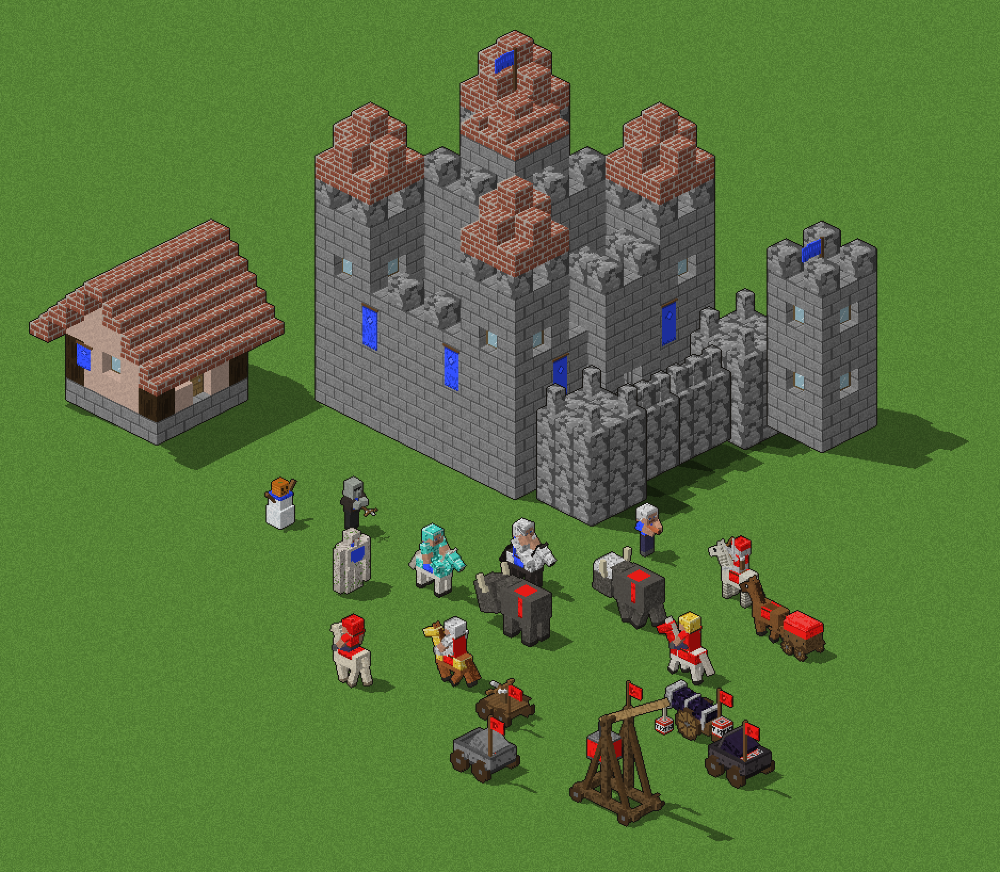
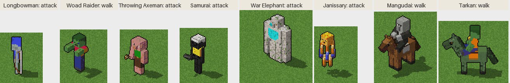
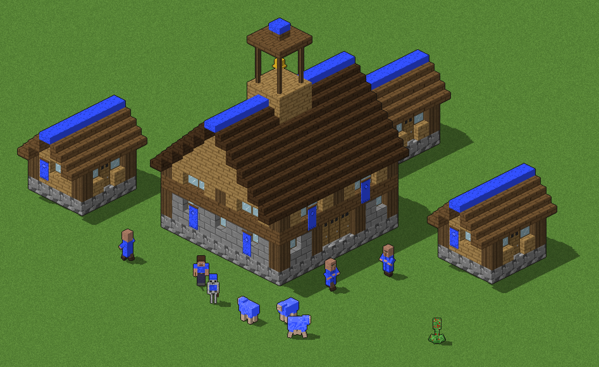
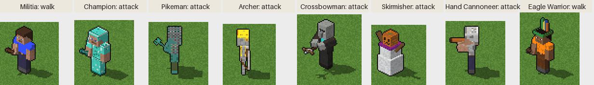

# Age of Minecraft — design

A graphics mod for **Age of Empires II: Gold Edition** (The Age of Kings +
The Conquerors) that redraws the units and buildings as blocky, pixel-art
Minecraft-style figures. Gameplay stays the same; only the sprites and unit
names change.



## Art direction

| Rule | Value | Why |
|---|---|---|
| Model units | Minecraft pixels: head 8×8×8, body 8×4×12, limbs 4×4×12 | The classic proportions everyone recognises |
| Scale | 1.5 screen px per Minecraft pixel → infantry ≈ 45 px tall; large siege and ships are drawn 1.1–1.6× bigger | Roughly the size of AoE2 units on a 96×48 tile |
| Camera | Orthographic, looking down at 30° (AoE2's 2:1 isometric view) | Sprites sit correctly on AoE2 terrain |
| Sampling | Nearest texel, no anti-aliasing | Keeps the pixel look and suits AoE2's 256-colour palette |
| Light | From the upper left and front; Minecraft-like flat face shading | Matches the lighting of the original sprites |
| Shadow | Ground shadow toward the lower right, stored as SLP shadow pixels | AoE2 blends shadows itself |
| Outline | 1 px dark outline | Tiny sprites stay readable on busy terrain |
| Team colour | 8 shades per player, on clothing, dyed leather, capes and wool | AoE2 swaps these palette ranges per player |

Every texture is original pixel art in the Minecraft *style*: no Mojang
texture files are used or needed.

### Where team colour goes

Team colour is Minecraft's own dye system: shirts, dyed leather armour, capes,
wool sails, llama carpets, saddle blankets and banners. Units in full metal
armour get a team-coloured cape, so you can always tell who owns them. Mobs
wear team colour too: skeletons get a dyed leather cap and tunic, and zombies
a team shirt. Siege weapons fly a team flag.

## Units

All **90 units** of the game are modelled; the complete list is in
[UNITS.md](UNITS.md). Each group has a preview sheet in `previews/roster_<group>.png`
and an animation sample in `previews/anim_<group>.gif`.

| Group | Minecraft take |
|---|---|
| Villager jobs | Minecraft villagers. They stand with crossed arms, and uncross them to work with the job's tool (axe, pickaxe, hoe, hammer, bow, fishing rod, shears). They carry logs, ore blocks, wheat or meat. The farmer wears a straw hat and the fisherman a bucket hat. |
| Swordsmen | Crafters whose armour goes up the tiers: none → leather → chainmail → iron → diamond, with wood → stone → iron → diamond swords |
| Spearmen | Drowned with tridents, gaining chainmail and iron |
| Archers | Skeleton → Pillager (crossbow) → Pillager Captain with a banner. Skirmishers are Snow Golems. The Hand Cannoneer carries a copper firework gun. |
| Eagle Warriors | Crafters in parrot-feather headdresses with clubs |
| Cavalry | Crafters on horses in Minecraft horse armour: leather → iron → gold → diamond |
| Camels | Llama riders; the llama wears a team carpet |
| Cavalry Archers | Skeleton horsemen |
| Monk / Missionary | Cleric villager in a hooded team robe with a book (the Missionary rides a donkey) |
| Siege | Ravager rams (bare → iron-capped → netherite). Dispenser minecarts as mangonels. Crossbow turrets as scorpions. A TNT cannon with an obsidian barrel. A log-frame trebuchet that packs flat. |
| Wagons | War Wagon as a covered wagon with a team canopy; Trade Cart as a chest minecart pulled by a donkey |
| Ships | Minecraft boats scaled up, with team wool sails. The Fire Ship carries a campfire (soul fire when upgraded), the Demolition Ship is loaded with TNT, and the Cannon Galleon mounts a TNT cannon. |
| Unique units | Longbowman → Stray · Woad Raider → Zombie · Chu Ko Nu → Illusioner · Throwing Axeman → Piglin · Huskarl → Piglin Brute · Samurai → Wither Skeleton · War Elephant → Iron Golem · Teutonic Knight → netherite knight · Janissary → Blaze · Berserk → Vindicator · Jaguar Warrior → ocelot-hooded warrior · Plumed Archer → Bogged · Cataphract → netherite-barded horseman · Mangudai → Pillager on horseback · Mameluke → Husk on a llama · Tarkan → Zombie on a zombie horse · Conquistador → firework rider · War Wagon → armoured wagon · Longboat → spruce longship with shields · Turtle Ship → turtle-shell ship |
| Animals | Sheep (dyed wool) · Turkey → Chicken · Deer → Goat · Wild Boar → Hoglin · Javelina → Pig · Wolf |



## Buildings



Buildings are made of real Minecraft-scale blocks, at the same scale as the
units: a unit is 2 blocks tall, as in Minecraft. One AoE2 tile comes to about
2.8 blocks at the render scale, so:

| Footprint | Blocks | Examples |
|---|---|---|
| 2×2 tiles | 5×5 | House, Mill, Lumber / Mining Camp |
| 3×3 tiles | 8×8 | Barracks, Archery Range, Stable, Market |
| 4×4 tiles | 11×11 | Town Center, Castle |
| 5×5 tiles | 14×14 | Wonder |

Buildings are drawn from a single angle (their south-west and south-east
walls face the camera). Team colour shows on wool roof ridges, banners, and
the flag on top.

### Building mapping

| AoE2 building | Minecraft build | |
|---|---|---|
| House | Plains-village cottage: cobblestone base, log corners, stair roof | ✅ |
| Town Center | Village hall with a bell tower (the village meeting point) | ✅ |
| Barracks | Armourer's hall with armour stands and a blast furnace | 🧱 |
| Archery Range | Fletcher's hut with target blocks | 🧱 |
| Stable | Stable with hay bales and fences | 🧱 |
| Blacksmith | Weaponsmith with an anvil, grindstone and lava forge | 🧱 |
| Market | Trading stalls with emeralds | 🧱 |
| Mill | Farmer's hut with a composter and hay | 🧱 |
| Farm | Wheat field with a water channel | 🧱 |
| Lumber Camp / Mining Camp | Log pile with a chopping block / mineshaft with rails and a minecart | 🧱 |
| Monastery | Cleric's temple with a brewing stand | 🧱 |
| University | Library with bookshelves and an enchanting table | 🧱 |
| Siege Workshop | Workshop with pistons, TNT and dispensers | 🧱 |
| Dock | Oak pier with a boat | 🧱 |
| Watch Tower line | Pillager-outpost-style watch tower | 🧱 |
| Palisade / Stone Wall / Gate | Oak fence / cobblestone wall / fence gate and iron door | 🧱 |
| Castle | Stone-brick keep with crenellations | 🧱 |
| Wonder | Beacon pyramid of iron, gold and diamond blocks, with the light beam | 🧱 |
| Trees, gold, stone, berries | Oak trees, gold ore, stone boulders, sweet berry bushes | 🧱 |

### Ages and architecture sets

AoE2 changes how buildings look by age and by civilisation. Minecraft has a
natural answer for both:

* **Ages as materials**: Dark Age oak and dirt paths → Feudal cobblestone →
  Castle stone bricks → Imperial polished stone, quartz and gold trim.
* **Civilisations as village biomes**: Western European → Plains, Eastern
  European → Taiga, Middle Eastern → Desert, Asian → Savanna / Snowy,
  Meso-American → Jungle.

### Construction and destruction

AoE2 needs construction stages, damage and rubble sprites for each building.
Since the buildings are made of blocks, these come almost free:

* **construction**: the building rises layer by layer, the way a player builds
* **damage**: blocks missing, with fire
* **rubble**: scattered blocks and a crater

## Animations

AoE2 needs a set of sprites for each unit: **stand, walk, attack, die and
decay** (the corpse), and villagers also walk while carrying. Each animation
is stored for 5 directions (S, SW, W, NW, N). The game mirrors those to get
NE, E and SE. Because the figures are 3D box models, every direction and
frame is rendered automatically, with no redrawing by hand.

Each unit has a **rig** (how its body moves) and an **attack style**:

| Attack style | Units | Motion |
|---|---|---|
| chop | swordsmen, cavalry, villagers at work | overhead swing |
| thrust | spearmen | pull back, then stab |
| bow | archers, cavalry archers | raise the bow, draw, release |
| crossbow / gun | crossbowmen, hand cannoneers | recoil |
| throw | skirmishers, throwing axemen, mamelukes | wind up and throw |
| cast | monks | both arms raised, waving |
| punch / slam | zombies, iron golem | arms swing together |
| work motions | fisherman, forager, shepherd | cast the rod, bend and pick, snip |
| ram / fire | ravagers, carts, ships | head-butt, recoil |
| trebuchet | trebuchet | the counterweight drops and the arm throws over the top; it packs flat to move |

Deaths use Minecraft's look: the body tips over sideways and flashes red.
Siege burns and tips over, and ships sink. Decay (the corpse) is planned as a
puff of smoke, like mob deaths in Minecraft.



## Pipeline

```
box model + pixel textures  ──render──▶  frames (colour + team-colour mask + shadow)
        ──quantise──▶  AoE2 palette indices  ──encode──▶  .slp files
        ──import──▶  Data/graphics.drs  (on the player's PC)
```

1. **Render** (`tools/aom`). A small ray-caster draws the models from the
   AoE2 camera angle. It keeps each pixel's kind (solid, team colour, shadow,
   outline) separate, so the output converts exactly to SLP.
2. **Quantise** (`palette.py`). Solid colours snap to the game's own
   256-colour palette (`50500` in `interfac.drs`), using nearest colour in
   CIELAB. Team-colour pixels become the 8 player-colour shades.
3. **Encode SLP** (`slp.py`). SLP 2.0N frames with outline tables, row
   commands, player-colour, shadow and the team-colour silhouette outline
   (shown when a unit is behind a building). The hotspot sits at the unit's
   feet.
4. **Match the original** (`build_mod.py`, on the player's PC). For each
   original sprite (ids in `slpmap.py`), the frame count, angle count and
   mirroring are read from the player's `graphics.drs` and `.dat`, and the
   animation is rendered in exactly that layout. Extra layers of composite
   sprites (ram heads, sails) are blanked.
5. **Install** as a UserPatch 1.5 data mod: `Games\AgeOfMinecraft.xml`,
   `Games\AgeOfMinecraft\Data\graphics.drs`, and
   `age2_x1\AgeOfMinecraft.exe` made by `SetupAoC.exe -g:AgeOfMinecraft`.
   A `--mode direct` fallback patches `Data\graphics.drs` with a backup.

See [INSTALL.md](INSTALL.md) for how to run it.

## Open questions

* Villager: idle villagers keep their arms crossed, and working villagers
  uncross them. Is that the look you want, or should they always have free
  arms?
* Creeper: team-colour speckles, or plain green with only its feet in team
  colour?
* Scale: are infantry at ≈ 45 px the right size next to the original
  buildings, or should they be a little smaller?
* Buildings: should the roofs keep the team-coloured wool ridge, or only
  show banners (closer to the original game)?
* Which civilisation style should be the first full building set? (Plains
  is started.)
